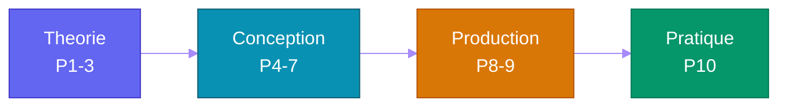

# SDV-Agentic-Dev

> Cours 100% open-source sur le developpement de **systemes agentiques** — de l'histoire de l'IA (Intelligence Artificielle) a la mise en production d'agents autonomes avec opencode + `opencode/big-pickle`.

---

## Sommaire

### Partie 1 — Histoire & Genese de l'IA
Des premiers tests de Turing a l'explosion des Transformers, en passant par les hivers, la revolution deep learning et l'avenement des systemes agentiques.

### Partie 2 — Architecture des LLM (Large Language Model)
Tokenisation, mecanisme d'attention, context window, scaling laws, modeles open-source.

### Partie 3 — Prompt Engineering & Tool Use
System prompt, few-shot, chain-of-thought, function calling, pattern ReAct (Reasoning + Acting).

### Partie 4 — Architecture Agentique
Boucle agent, etat, planification, outils, memoire court-terme.

### Partie 5 — Memoire & RAG (Retrieval-Augmented Generation)
Embeddings, vector stores, retrieval-augmented generation, memoire long-terme persistante.

### Partie 6 — Multi-Agent Orchestration
Supervisor, fan-out, debat, patterns de communication, files d'attente asynchrones.

### Partie 7 — MCP (Model Context Protocol) & Standards d'Interoperabilite
Model Context Protocol, A2A (Agent-to-Agent), connexion d'agents a des services externes.

### Partie 8 — CI/CD (Continuous Integration / Continuous Deployment) & DevOps pour Agents
Pipeline complet, tests d'agents, monitoring, gestion des couts tokens.

### Partie 9 — Securite & Safety des Agents
Prompt injection, jailbreak, sandboxing, permissions, OWASP (Open Worldwide Application Security Project) LLM.

### Partie 10 — Opencode & Mise en Pratique Agentique
Configurer une equipe d'agents opencode, rediger des skills, orchestrer un projet Scrum via agents.

---

---

## Projet reseau social

Ce cours s'appuie sur un projet concret : une **application web sociale simplifiee** (mur public, authentification, gestion d'utilisateurs). Le Cahier des Charges (CDC) est defini dans [`projet/gestion_de_projet/cdc.md`](projet/gestion_de_projet/cdc.md).

Les TP de chaque PARTIE montrent comment utiliser l'agentic (opencode + `opencode/big-pickle`) pour construire ce projet etape par etape : de l'assistant CLI (Command Line Interface) au deploiement CI/CD en passant par l'equipe multi-agent et les serveurs MCP (Model Context Protocol).

Le code source de l'application n'est **pas** fourni dans ce depot. Il est genere par les agents opencode a partir du CDC. Le repo contient uniquement le cours et la specification.

---

## Stack technique (100% open-source & gratuit)

| Outil | Role | Cout |
|---|---|---|
| [opencode](https://opencode.ai) | Plateforme agentic | Gratuit |
| `opencode/big-pickle` (modele) | LLM (Large Language Model) gratuit | Gratuit |
| Python + FastAPI | Backend | Gratuit |
| SQLite | Base de donnees | Gratuit |
| Docker | Conteneurisation | Gratuit |
| GitHub Actions | CI/CD | Gratuit (public) |

Aucune API (Application Programming Interface) payante (OpenAI, Anthropic) requise.
Tout le cours fonctionne avec **opencode + `opencode/big-pickle`**.

---

## Prérequis

- Python intermediaire (POO, typage, modules)
- Notions de base en bases de donnees (SQL)
- Git & GitHub
- Curiosite technique

## Organisation du depot

| Element | Emplacement |
|---|---|
| Cours complet | `PARTIE-01.md` a `PARTIE-10.md` |
| Specification projet | `projet/gestion_de_projet/cdc.md` |
| Projet applicatif (a generer) | `projet/app/` |
